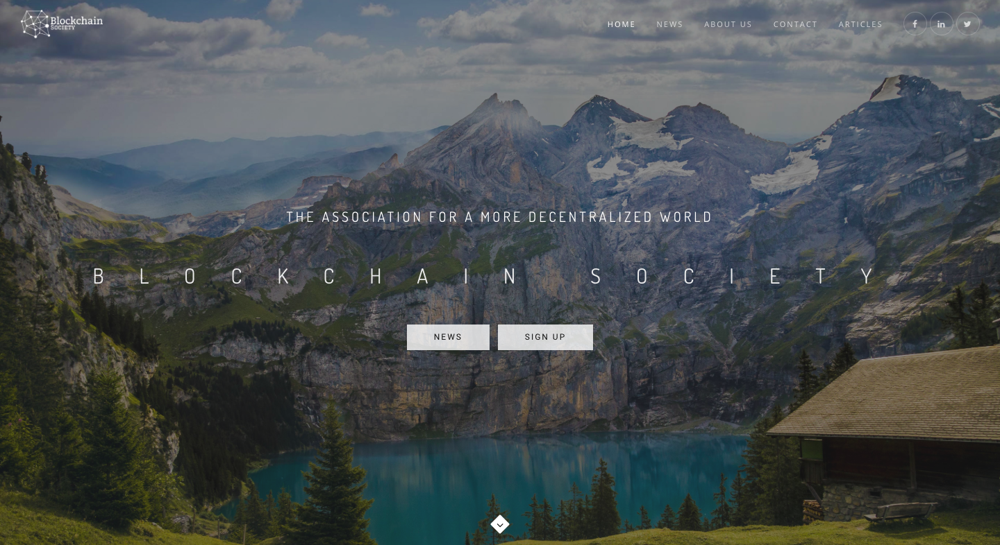

<b>Blockchain Society</b> is a Swiss student network that develop the blockchain ecosystem in the country.

## Introduction

In promote the activities of the Blockchain Society organization, I built a website using Wordpress.
This website presents the organization activities, goals, team, and articles.

## More

Visit our website [here](https://blockchainsociety.ch/)
