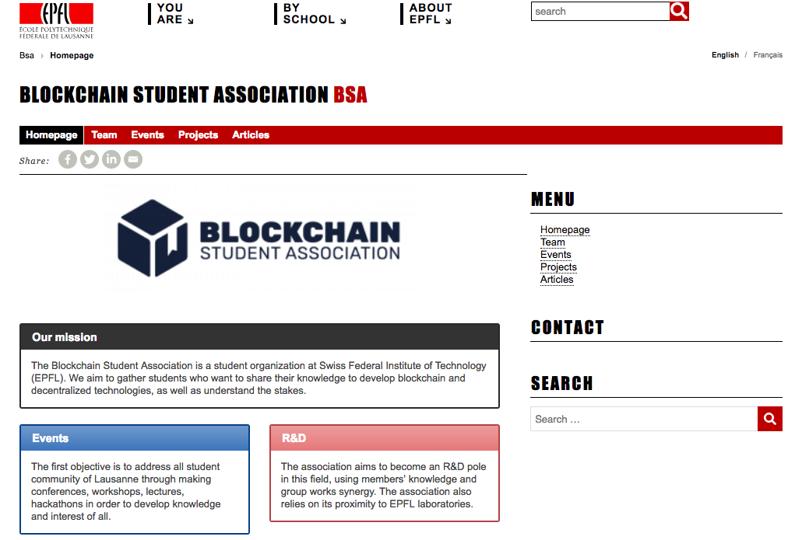

<b>BSA</b> is a student organization that develop decentralised systems ecosystem and applications at EPFL.

## Introduction

In order to promote the activities of our organization Blockchain Student Association (BSA), I built a simple website hosted on EPFL servers and using their Wordpress graphical charter.
This website presents our goals, activities, team, and articles.

## More

The website is currently active and you can visit it [here](https://bsa.epfl.ch/)
