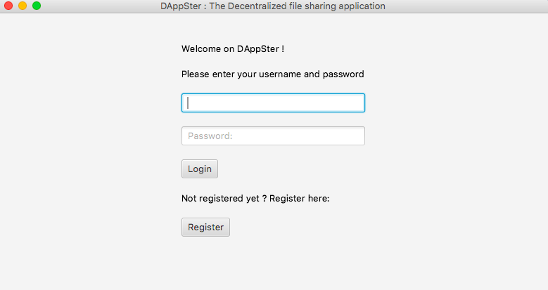

<b>DAppSter</b> is a decentralized file sharing system using Ethereum blockchain Technology.

## Introduction

Traditional peer-to-peer (P2P) file sharing protocols and architectures employ centralised entities, called trackers, to assist peers to find each other and express their interest in a file. Unfortunately, trackers can not guarantee the anonymity of the peers who may have security or even legal issues. Although modern P2P file sharing protocols are now trackerless and their function relies on distributed hash tables (DHTs), centralised entities are still needed to assist users of the file-sharing architecture to search for a file, before using the trackerless protocol to download it. In this work, we develop DAppSter, a distributed application that is composed of an Ethereum distributed application (DApp) and a client application implemented for mobile devices and desktops. DAppSter is designed to fully decentralise file sharing on the Internet. Extensive experimentation on Ethereum testnets shows that a DAppSter client can perform the same operations as in trackerless architectures in, on average, fifteen seconds.

## Context

This research project is done during my exchange year at Hong Kong University of Science and Technology with Stanislas Gal, Dr. Dimitris Chatzopoulos and Prof. Pan Hui. It was started at the beginning of September 2018.

## Steps

During the project, we want to built multiple tools and features as well as describe our approach and work.

* Write a paper that describe the project.
* Build a DAppSter java client for laptop.
* Build an DAppSter kotlin and java client for Android devices.
* Build an java client on top of BitTorrent where the users do not need either tracker or bootstrap nodes to share their files.

## More

* [Official public repository](https://github.com/stang-l/DAppSter)
* [Java client repository](https://github.com/pierre2356/DAppSterJava)
